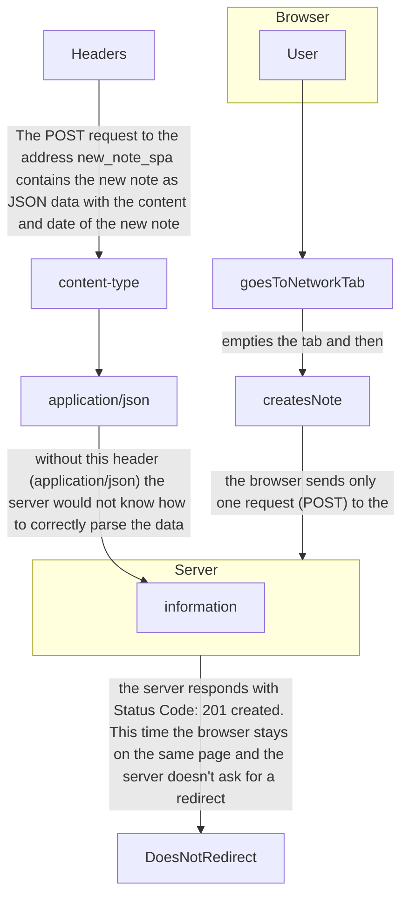

# Create a new note in Single Page App diagram

```mermaid
    flowchart TB
    subgraph Browser
        User
    end
    User --> goesToNetworkTab --empties the tab and then--> createsNote --the browser sends only one request (POST) to the--> Server
    subgraph Server
        information
    end
    Headers --The POST request to the address new_note_spa contains the new note as JSON data with the content and date of the new note--> content-type --> application/json --without this header (application/json) the server would not know how to correctly parse the data--> information
    Server --the server responds with Status Code: 201 created. This time the browser stays on the same page and the server doesn't ask for a redirect--> DoesNotRedirect     
```