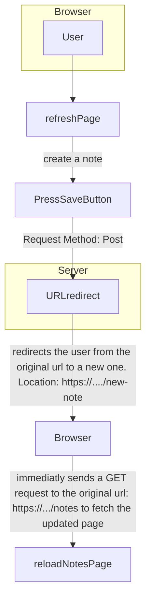

# Create a new note. Flowchart

```mermaid
    flowchart TB
    subgraph Browser 
        User 
    end
    User --> refreshPage --create a note--> PressSaveButton
    subgraph Server
        URLredirect
    end
    PressSaveButton --Request Method: Post --> URLredirect
    URLredirect --redirects the user from the original url to a new one. Location: https://..../new-note--> Browser
    Browser --immediatly sends a GET request to the original url: https://.../notes to fetch the updated page--> reloadNotesPage
```