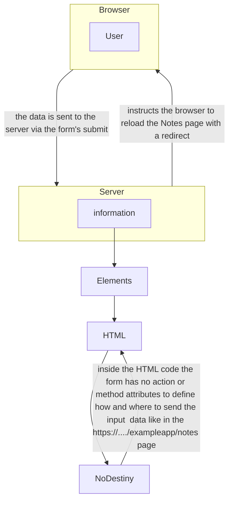

# Single Page App where the user only enters the page 

```mermaid 
    flowchart TB
    subgraph Browser
        User
    end
    Browser --the data is sent to the server via the form's submit --> Server --instructs the browser to reload the Notes page with a redirect----> Browser 
    subgraph Server
        information 
    end
    information --> Elements --> HTML --> NoDestiny
    NoDestiny --inside the HTML code the form has no action or method attributes to define how and where to send the input  data like in the https://..../exampleapp/notes page --> HTML
    
```